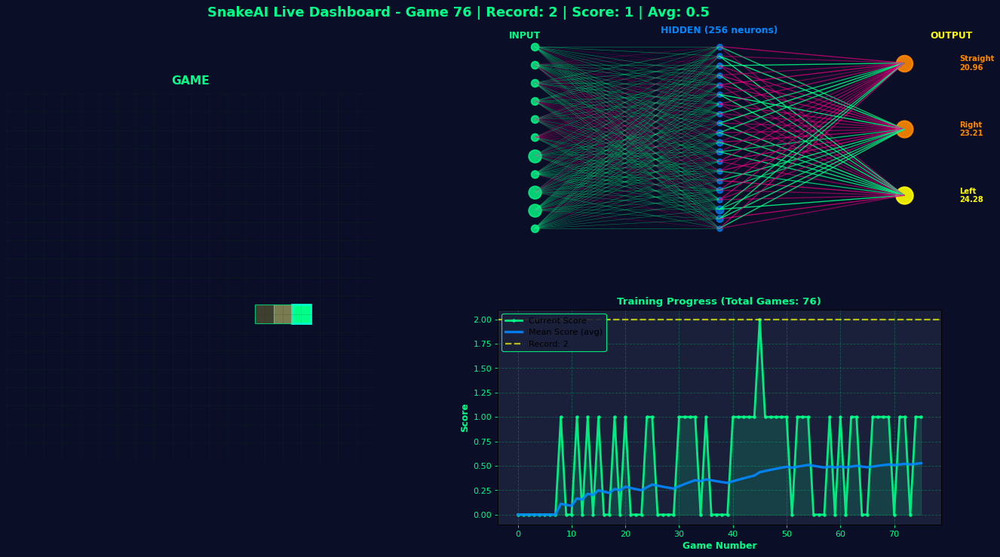

# SnakeAI — Deep Q-Learning (PyTorch)

Self-learning Snake agent with a compact DQN, headless training speed, and a live visual game window.

## Model
- State (11 features): danger straight/right/left, one-hot direction, food relative position.
- Network: 11 → 256 (ReLU) → 3 (Q-values for Straight, Right, Left).
- Loss/optimizer: MSE + Adam. Discount $\gamma = 0.9$.

## Rewards
- Eat food: +50
- Die: -50
- Move closer to food: +0.1; farther: -0.1
- Starvation guard: terminate if steps exceed 100 × length.

## Run
```bash
pip install torch pygame matplotlib numpy
python agent.py
```
- Runs 3 environments; only the first is visual so you see the snake, others stay headless for speed.
- `dashboard.png` is regenerated each game (training curve + network view + current board). Delete or gitignore PNGs if keeping the repo clean.

## Notes
- Checkpoints: `model/model.pth` and `model/memory.pkl` persist across runs.
- Epsilon anneals over the first ~200 games for faster early exploration.
- CPU by default; switch device in `model.py` when ready for GPU.

## Findings (recent run)
- Record score: 54 at ~200 games (3-env training, first env visual).
- Replay buffer restored ~100k experiences on resume; checkpoints proven to load/save cleanly.
- Dashboard updates every game; PNGs are regenerated and safe to gitignore.

## Sample dashboard
